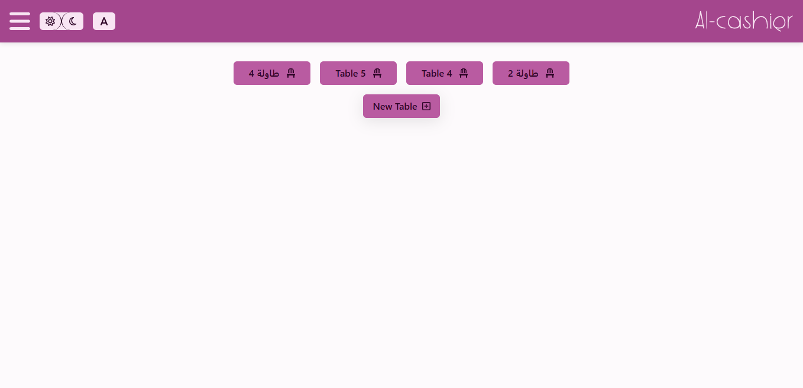
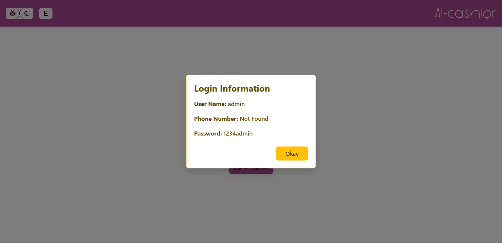
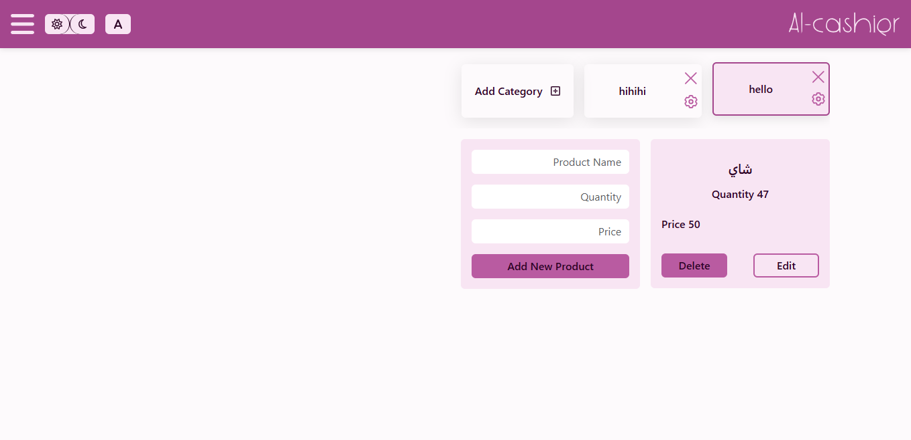
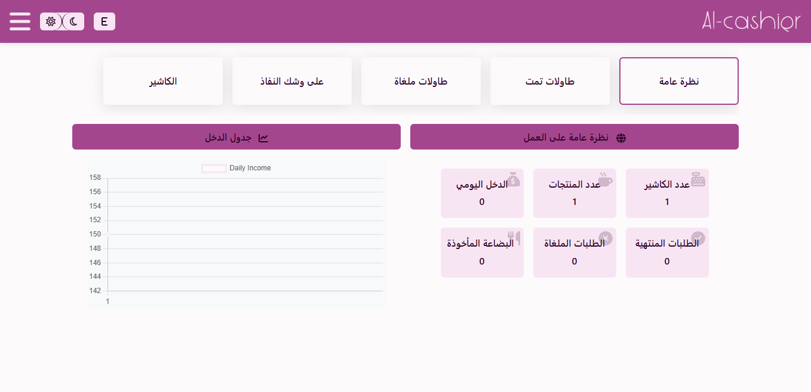
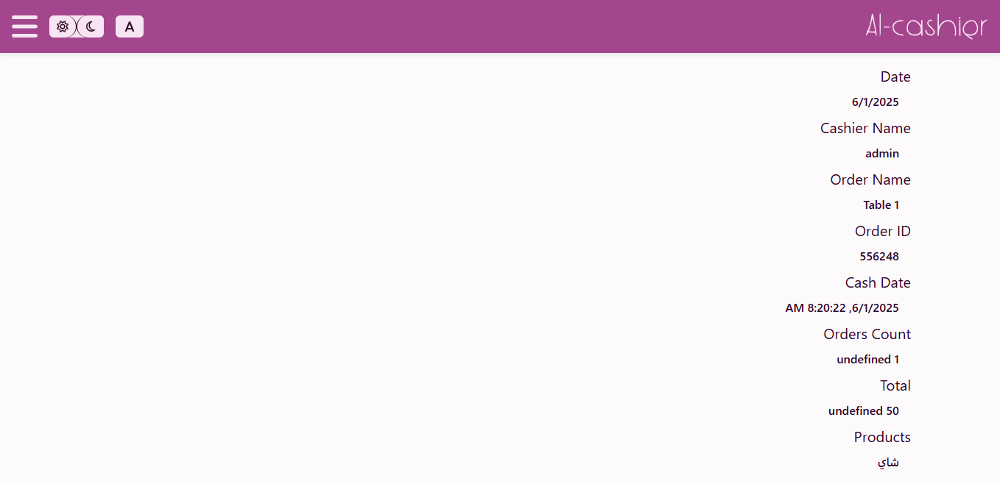
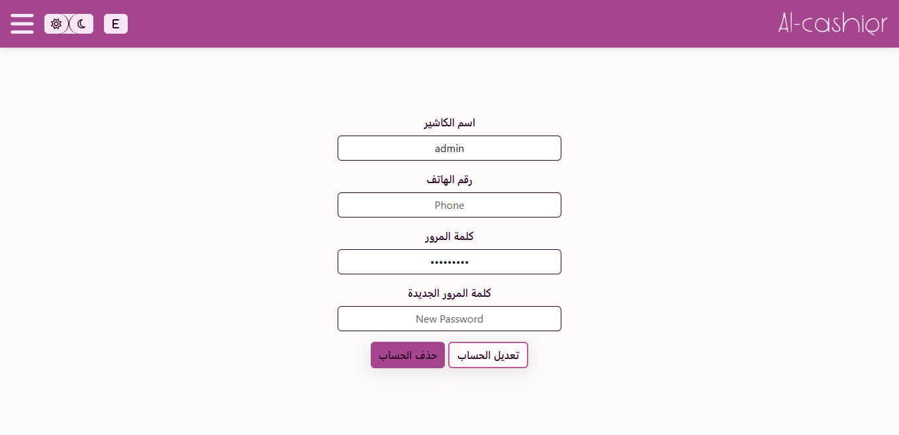
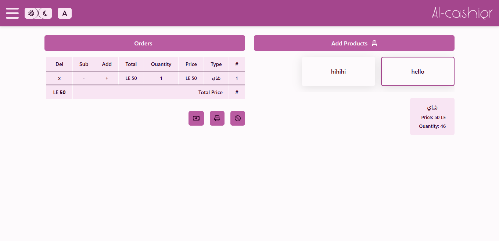
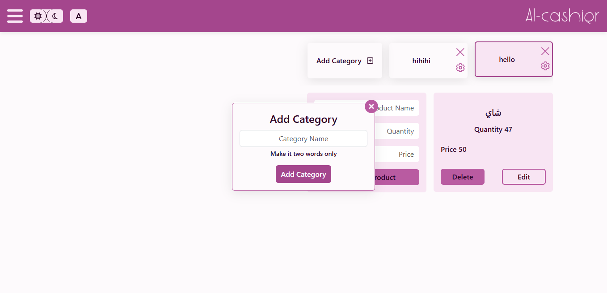
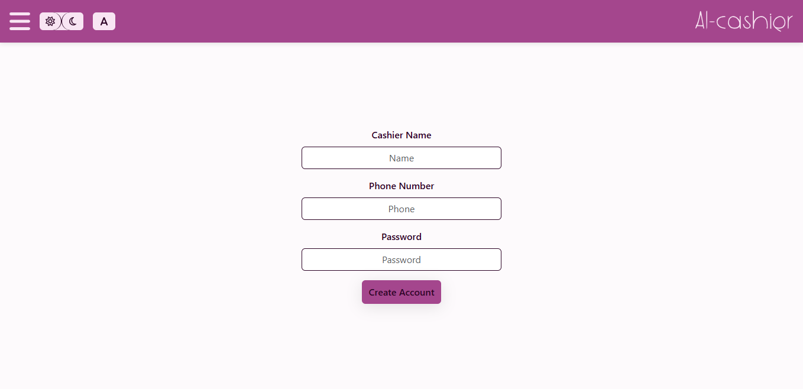

# 🏪 AL-Cashier v2.0.0

<div align="center">
  


*A comprehensive cafeteria management system built with vanilla JavaScript*

[](https://al-cashier.netlify.app)
[](#)
[](LICENSE)

</div>

## 🖼️ Live Preview

<div align="center">

| 🔐 Login | 🏠 Dashboard | 🍽️ Menu Management |
|:---:|:---:|:---:|
|  |  |  |
| Secure authentication system | Dynamic table management | Real-time menu updates |

</div>

<div align="center">

| 📊 Reports & Analytics | 🧾 Order Details | 👤 Profile Management |
|:---:|:---:|:---:|
|  |  |  |
| Comprehensive business analytics | Detailed order tracking | User profile customization |

</div>

## 📋 Table of Contents

- [🖼️ Live Preview](#live-preview)
- [📖 About](#about)
- [✨ Features](#features)
- [🚀 Quick Start](#quick-start)
- [📚 Documentation](#documentation)
- [🎨 Complete Application Walkthrough](#complete-application-walkthrough)
- [🛠️ Technologies Used](#technologies-used)
- [👨‍💻 Author](#author)
- [📄 License](#license)

## 📖 About

AL-Cashier is a modern, responsive web application designed to help cafeteria owners efficiently manage their businesses. Built with vanilla JavaScript and modern web technologies, it provides a complete point-of-sale solution with multilingual support and comprehensive reporting features.

### 🎯 Key Highlights

- **Zero Dependencies**: Built with vanilla JavaScript for maximum performance
- **Multilingual**: Full support for Arabic and English with RTL/LTR layouts
- **Responsive Design**: Works seamlessly on desktop, tablet, and mobile devices
- **Real-time Updates**: Dynamic content management and live data synchronization
- **Advanced Reporting**: Comprehensive business analytics with interactive charts
- **Role-based Access**: Secure admin and cashier user roles with different permissions

### 🏆 Why Choose AL-Cashier?

<div align="center">

| 🚀 **Performance** | 🌍 **Accessibility** | 📊 **Analytics** | 🔒 **Security** |
|:---:|:---:|:---:|:---:|
| Vanilla JS = Fast Loading | Arabic & English Support | Real-time Business Insights | Role-based Access Control |
| No External Dependencies | RTL/LTR Layout Support | Interactive Charts & Reports | Secure Authentication |
| Optimized for All Devices | Mobile-First Design | Inventory Management | Data Protection |

</div>

## ✨ Features

<div align="center">

### 🔐 Authentication & User Management


- Secure login/register system with role-based access
- Admin and Cashier user roles with different permissions
- Profile management with editable information

### 🪑 Table Management & Orders


- Dynamic table creation and management
- Real-time order assignment to tables
- Table status tracking and order processing

### 🍽️ Menu Management


- Dynamic category and item management
- Real-time menu updates
- Stock quantity tracking

### 📊 Advanced Reporting


- Business overview dashboard with interactive charts
- Completed orders analysis with visual data
- Canceled orders tracking and insights
- Low stock alerts and inventory management
- Individual cashier performance reports

### 🌐 Additional Features


- Dark/Light theme toggle for better user experience
- Arabic/English language switcher (RTL/LTR support)
- Print functionality for orders and receipts
- Responsive design for all screen sizes

</div>

## 🚀 Quick Start

### Prerequisites
- Modern web browser
- Local web server (Live Server extension for VS Code recommended)

### Installation

1. **Clone the repository**
   ```bash
   git clone https://github.com/ismaeilalrewany/alcashier.git
   cd alcashier
   ```

2. **Start local server**
   - Using VS Code Live Server: Right-click on `public/index.html` → "Open with Live Server"
   - Using Python: `python -m http.server 8000` (from public folder)
   - Using Node.js: `npx serve public`

3. **Access the application**
   - Open `http://localhost:5500` (or your server's URL)
   - Default login: Admin credentials available in documentation

## 📚 Documentation

Comprehensive documentation is available in the `docs/` folder:

- **[🏗️ Installation Guide](docs/installation.md)** - Detailed setup instructions
- **[🎯 User Guide](docs/user-guide.md)** - How to use the application
- **[🔧 API Reference](docs/api-reference.md)** - Technical implementation details
- **[🎨 UI Components](docs/ui-components.md)** - Design system and components
- **[🚀 Deployment](docs/deployment.md)** - Production deployment guide
- **[🔄 Version History](docs/version-history.md)** - Changelog and updates

## 🎨 Complete Application Walkthrough

<div align="center">

### 🔑 Getting Started

*Secure authentication with role-based access control*

### 🏠 Dashboard Overview

*Dynamic table management and real-time order tracking*

### 🍽️ Menu & Categories

*Comprehensive menu management with real-time updates*

### 📊 Business Analytics

*Advanced reporting with interactive charts and insights*

</div>


## 🛠️ Technologies Used

| Technology | Version | Purpose |
|------------|---------|---------|
| HTML5 | - | Structure and semantic markup |
| CSS3 | - | Styling and animations |
| JavaScript | ES6+ | Core functionality |
| Bootstrap | v5.3.3 | Responsive design framework |
| Chart.js | v4.4.7 | Data visualization |
| Font Awesome | Pro v6.5.1 | Icons and UI elements |
| i18next | v24.2.0 | Internationalization |

## 👨‍💻 Author

**Ismaeil Alrewany**

- 📧 Email: [ismailalrewany332@gmail.com](mailto:ismailalrewany332@gmail.com)
- 🐙 GitHub: [@ismaeilalrewany](https://github.com/ismaeilalrewany)
- 💼 LinkedIn: [ismaeil-alrewany](https://www.linkedin.com/in/ismaeil-alrewany/)

## 📄 License

This project is licensed under a **Custom License** - see the [LICENSE](LICENSE) file for details.

> **Note**: This project is for demonstration purposes only, showcasing programming skills for job-seeking purposes. Commercial use and modification are prohibited.

---

<div align="center">
  
**Made with ❤️ by Ismaeil Alrewany**

*Version 2.0.0 - Released June 2025*

</div>
