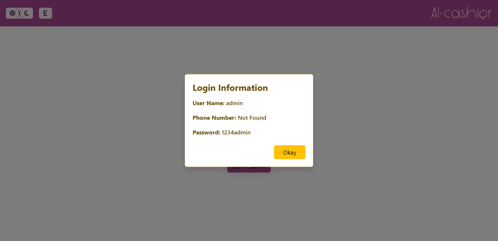
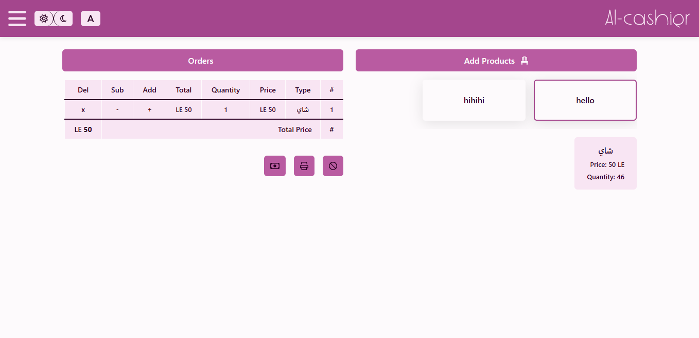
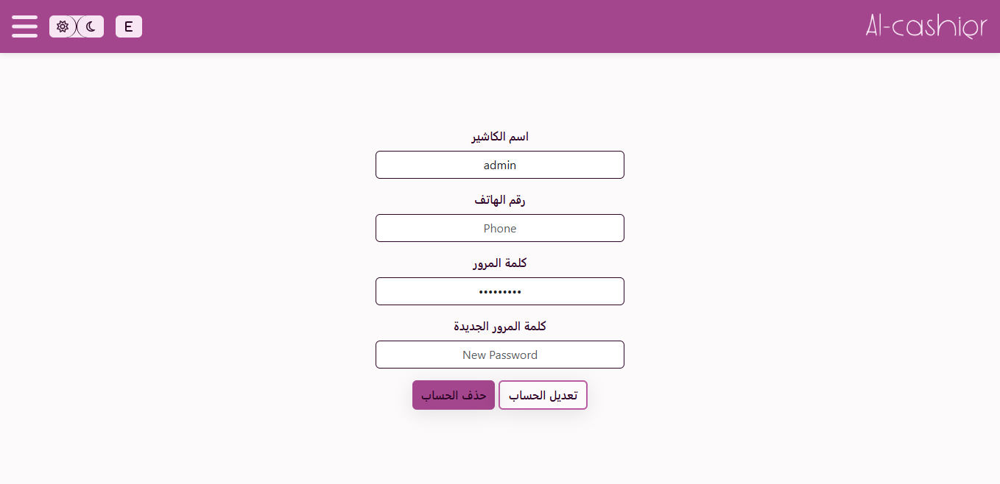
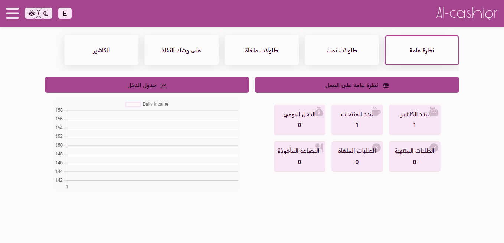
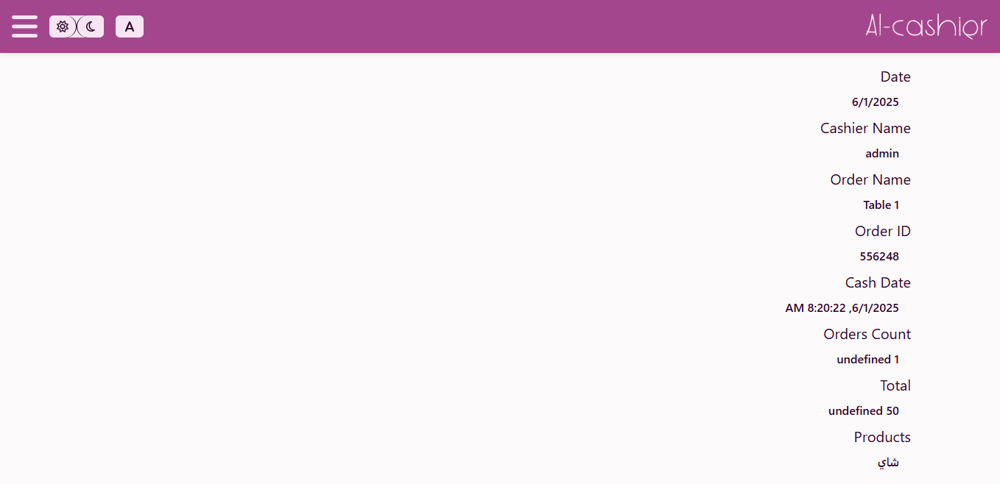
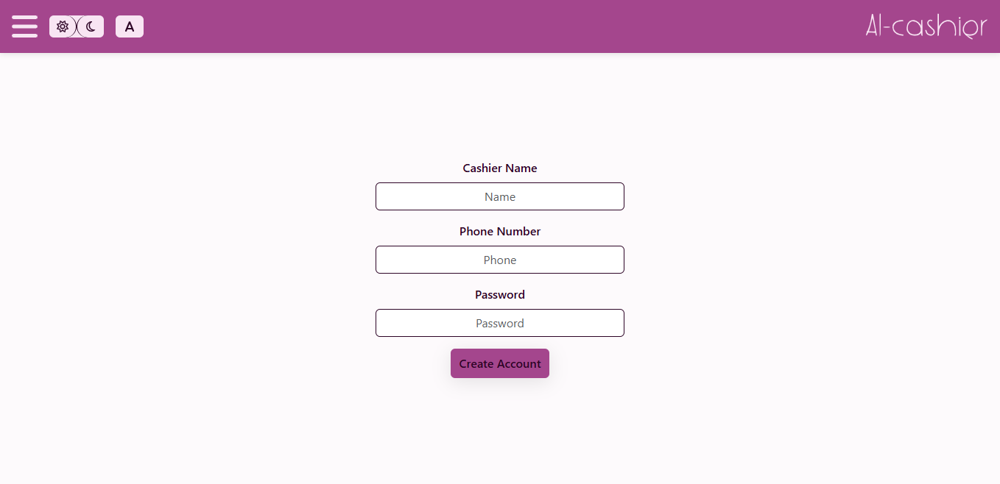

# 🎯 User Guide

Welcome to AL-Cashier! This comprehensive guide will help you understand and use all features of the application effectively.

## 🔐 Getting Started

### First Login

1. **Open the Application**
   - Navigate to the AL-Cashier homepage
   - Click on the "Login" button or navigate to `/login`

2. **Default Credentials**
   - **Admin**: username: `admin`, password: `1234admin`
   - **Cashier**: username: `cashier`, password: `cashier123`

### User Roles

**Admin Features:**
- Full access to all application features
- User management (register new cashiers)
- Menu management (categories and items)
- Reports and analytics
- System settings

**Cashier Features:**
- Table management
- Order processing
- Basic reporting
- Profile editing

## 🏠 Homepage - Table Management

The homepage is your central hub for managing tables and orders.

### Adding Tables

1. Click the **"Add Table"** button
2. Enter a table name (e.g., "Table 1", "VIP Table")
3. Click **"Add"** to create the table
4. The table will appear in the tables grid

### Managing Tables

- **Select Table**: Click on any table to view/manage orders
- **Table Status**: Visual indicators show if tables have active orders
- **Dynamic Layout**: Tables automatically arrange in a responsive grid

## 📝 Order Management

### Creating Orders

1. **Select a Table**: Click on the table where customers are seated
2. **Add Items**: Browse menu categories and add items to the order
3. **Adjust Quantities**: Use +/- buttons to modify item quantities
4. **Remove Items**: Click the delete button to remove items
5. **Finalize Order**: Submit the order when ready

### Order Features

- **Real-time Updates**: Orders update immediately across the system
- **Item Customization**: Modify quantities and remove items easily
- **Order Total**: Automatic calculation of order totals
- **Print Functionality**: Print orders for kitchen or customer receipts

## 🍽️ Menu Management (Admin Only)

The menu system allows complete control over categories and items.

### Category Management

1. **Add Category**
   - Click **"Add Category"**
   - Enter category name (e.g., "Hot Drinks", "Sandwiches")
   - Save the category

2. **Edit Category**
   - Click the gear icon on any category
   - Modify the category name
   - Save changes

3. **Delete Category**
   - Click the X icon on the category
   - Confirm deletion (this will also delete all items in the category)

### Item Management

1. **Add Items**
   - Select a category
   - Click **"Add Item"**
   - Fill in item details:
     - Name
     - Price
     - Initial quantity
     - Description (optional)

2. **Edit Items**
   - Click edit icon on any item
   - Modify item properties
   - Save changes

3. **Stock Management**
   - Monitor item quantities
   - Update stock levels as needed
   - Set low-stock alerts

## 👤 Profile Management

All users can manage their personal profiles.

### Editable Information

- **Display Name**: Your name as shown in the system
- **Phone Number**: Contact information
- **Password**: Change your login password
- **Language Preference**: Choose between Arabic and English
- **Theme Preference**: Switch between light and dark modes

### Profile Security

- **Password Requirements**: Use strong passwords
- **Regular Updates**: Keep profile information current
- **Session Management**: Logout when session ends

## 📊 Reports & Analytics (Admin Only)

The reports section provides comprehensive business insights.

### Report Types

#### 1. General Overview
- **Total Sales**: Daily, weekly, monthly revenue
- **Order Statistics**: Completed vs. canceled orders
- **Popular Items**: Best-selling menu items
- **Peak Hours**: Busiest times of day

#### 2. Completed Orders
- **Order Details**: Complete order history
- **Revenue Analysis**: Sales by date, time, cashier
- **Charts**: Visual representation of sales data
- **Export Options**: Download reports for analysis

#### 3. Canceled Orders
- **Cancellation Tracking**: Monitor canceled orders
- **Reasons Analysis**: Understand cancellation patterns
- **Impact Assessment**: Revenue loss from cancellations

#### 4. Stock Management
- **Inventory Levels**: Current stock quantities
- **Low Stock Alerts**: Items requiring restocking
- **Usage Patterns**: Item consumption trends

#### 5. Cashier Performance
- **Individual Reports**: Performance by cashier
- **Working Hours**: Time tracking
- **Sales Performance**: Revenue generated per cashier
- **Efficiency Metrics**: Orders processed per hour

### Order Details

Click on any order in the reports to view comprehensive details:

- **Order Summary**: Items, quantities, total
- **Timing Information**: Order creation and completion times
- **Cashier Information**: Who processed the order
- **Table Information**: Where the order was placed
- **Payment Details**: Payment method and amount

## 👥 User Registration (Admin Only)

Admins can register new cashier accounts:

### Registration Process

1. **Access Registration**: Navigate to `/register` (admin only)
2. **Enter User Details**:
   - Username (must be unique)
   - Full name
   - Phone number
   - Initial password
   - Role assignment

3. **Validation**: System validates all inputs
4. **Account Creation**: New user account is created
5. **Credentials**: Provide login details to new user

## 🌐 Language & Theme Settings

### Language Switching
- **Arabic**: Right-to-left layout with Arabic fonts
- **English**: Left-to-right layout with Latin fonts
- **Real-time**: Changes apply immediately without page reload

### Theme Options
- **Light Mode**: Professional daytime interface
- **Dark Mode**: Eye-friendly nighttime interface
- **System Preference**: Automatically match device theme

## 🖨️ Printing Features

### Order Printing
- **Kitchen Orders**: Print orders for kitchen staff
- **Customer Receipts**: Generate customer receipts
- **Format Options**: Choose print layout and size
- **Preview**: Review before printing

### Print Settings
- **Paper Size**: A4, thermal printer formats
- **Content**: Select what information to include
- **Copies**: Set number of copies needed

## 📱 Mobile Usage

AL-Cashier is fully optimized for mobile devices:

### Mobile Features
- **Touch-Friendly**: Large buttons and touch targets
- **Responsive Layout**: Adapts to screen size
- **Gesture Support**: Swipe and tap interactions
- **Offline Capability**: Works without internet connection

### Mobile Best Practices
- **Portrait Orientation**: Optimized for vertical screens
- **Fast Loading**: Minimal data usage
- **Battery Efficient**: Optimized performance

## 🔧 Troubleshooting

### Common Issues

1. **Login Problems**
   - Verify username and password
   - Clear browser cache
   - Check internet connection

2. **Data Not Saving**
   - Ensure browser allows local storage
   - Check available storage space
   - Refresh the page

3. **Print Issues**
   - Check printer connection
   - Verify print settings
   - Try different browser

4. **Performance Issues**
   - Close unnecessary browser tabs
   - Clear browser cache
   - Update browser to latest version

### Getting Help

- **Check Documentation**: Review relevant guide sections
- **Browser Console**: Check for error messages
- **Contact Support**: Reach out to the development team

## 💡 Tips & Best Practices

### For Cashiers
- **Regular Logout**: End sessions properly
- **Order Accuracy**: Double-check orders before submission
- **Table Management**: Keep table status updated
- **Stock Awareness**: Monitor item availability

### For Admins
- **Regular Backups**: Export important data regularly
- **Menu Updates**: Keep menu items current
- **User Management**: Monitor user access and permissions
- **Performance Monitoring**: Review reports regularly

### General Usage
- **Browser Updates**: Keep browser updated
- **Secure Passwords**: Use strong, unique passwords
- **Regular Training**: Stay updated on new features
- **Feedback**: Provide feedback for improvements

---

**Next Steps**: Explore the [API Reference](api-reference.md) for technical details or check the [UI Components](ui-components.md) guide for design information.
